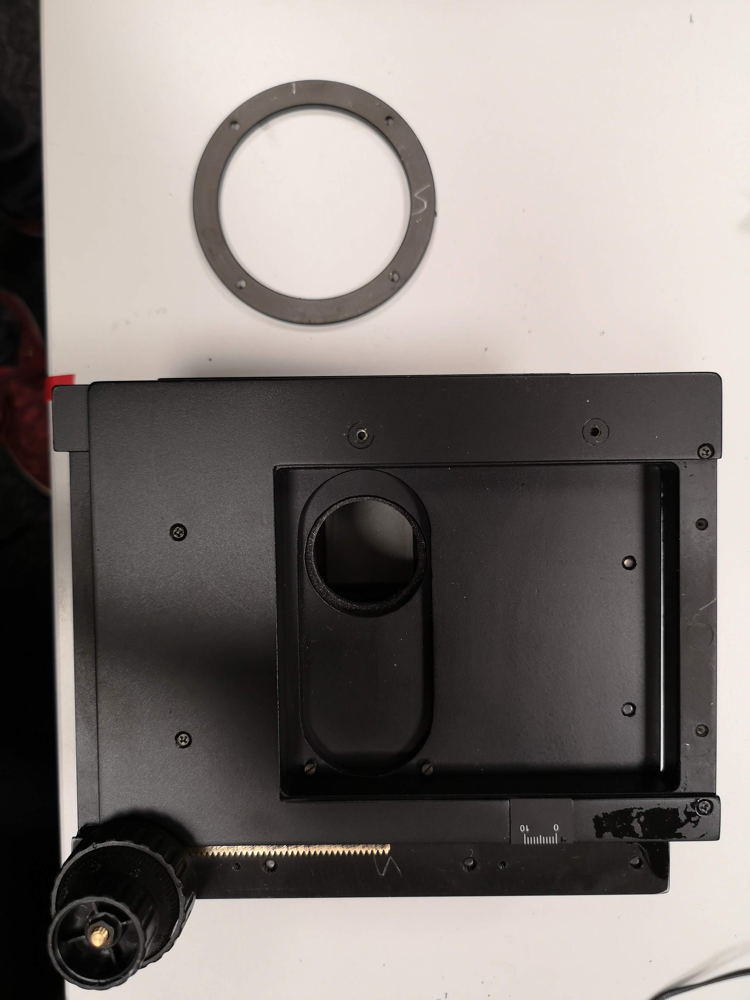

# openUC2 *Motorized XY Table*
---

__keywords__: Stepper motors, Arduino, Python, Freecad, 3D printing

The goal of this project is to convert a manual microscope stage into a motorized one that can be used with the UC2 system.
The stage is controlled through a common GRBL (i.e. 3D printer/CNC) interface and also integrates into the [ImSwitch](https://github.com/beniroquai/ImSwitch/tree/master/imswitch) software to control complex microscopy setups.
The precision of displacement approaches the micrometer. 
This repo is a fork from the [SonyCSLParis](https://github.com/SonyCSLParis/Motorized-stage) group.

Curious to see what this looks like? Keep scrolling!

All necessary parts besides the motors and the stage can be 3D printed. The overall price is ~200€.

***Features:***

The knobs initially used to manually move the platform are linked to motors via 2 belt-pulley systems (X and Y displacements). One removable part of the platform is replaced by a 3D-printed part that allows to fix the two motors. The pulleys are also 3D-printed to fit on the knobs. 

* Interact with it using GRBL/GCode
* large-scale microscopy slide scanning 
* easy to build 
* simple to automate 
* 

## In-Action

*The stage in action.*

# Software

The stage is drive by 2 NEMA 17 stepper motors. For this we use a simple Arduino + CNC Shield v3. We don't want to specify the correct usage of the code here as there are many tutorials for how to interact with stepper motors and Arduino through e.g. Python. A more in-depth tutorial can be found in our [UC2-Hi2 APP](https://github.com/openUC2/UC2-Hi2) that makes use of the Makerbase MKS board and a customized PYTHON Interface. 
If you need assistance, don't hesitate to reach out to us! 

# Hardware

Below we describe how the device can be build and assembled in order to replicate the whole system as shown in the rendering above. One needs additional parts that can be found in the core [openUC2 repository](https://github.com/bionanoimaging/UC2-GIT).

## Bill of material

Below you will find all components necessary to build this device

### 3D printing files

All these files need to be printed. We used a Prusa i3 MK3 using PLA Prusament (Galaxy Black) at layer height x.x mm and infill xx%.

All files can be found in the folder [STL]
***THIS WILL BE UPDATED SOON!***

|  Type | Details  |  Price | Link  | IMAGE |
|---|---|---|---|---|
| Sample inset |  This can hold three standard sample slides |  1,00 € | [Part.stl](./STL/30_XYTable_Aliexpress_sampleinsert.stl)  | 
 
  |
| Motor mount |  This holds the two NEMA 17 stepper motors |  1,00 € | [Part.stl](./STL/30_XYTable_Aliexpress_motormount.stl)  | 
 
  |
| UC2 mount |  This mounts the stage on the cubes |  1,00 € | [Part.stl](./STL/30_XYTabel_Aliexpress_basplateadapter.stl)  | 
 
  |
| Gear Large | For the belt |  1,00 € | [Part.stl](./STL/large_button_100t.stl)  | |
| Gear small |  For the belt |  1,00 € | [Part.stl](./STL/medium_button_80t.stl)  |  |
| 2x Pulley  |  For the belt |  1,00 € | [Part.stl](./STL/PulleyGT2_nut.stl)  |  |

***OPTIONAL***: The GT2 timing belts can be printed using TPU/ninjaflex material.

### Additional parts
This is used in the current version of the setup

|  Type | Details  |  Price | Link  |
|---|---|---|---|
| Microscopy XY table |  |  55€ + Shiping  | [Aliexpress](https://de.aliexpress.com/item/32850719102.html)  |
| Microscopy XY table (German Alternative) |  |  255€ + Shiping  | [Optik Pro](https://www.optik-pro.de/fuer-stereomikroskope/euromex-xy-tisch-dz-9020-185x145mm-dz-reihe/p,47040)  |
| 2x Pancake NEMA 17 motors  |  9€ + Shiping  | [Ebay](https://www.ebay.de/itm/392553834244?mkevt=1&mkcid=1&mkrid=707-53477-19255-0&campid=5338766899&toolid=10029&customid=fc3455a0e96f52a60f2ec9abd03107d9&_trkparms=ispr%3D1&amdata=enc%3A1vaiEtGA-SQiwyEWSYtvliA35)  |
| Motor belt GT2 |2 |1€|[Phidgets](https://www.phidgets.com/?tier=2&catid=42&pcid=35) |
| Motor pulley 20 teeth/5mm bore |2 | 1€ |[Phidgets](https://www.phidgets.com/?tier=2&catid=42&pcid=35) | |
| Arduino + CNC Shield v3 + A4988 Drivers + 12 V supply  |2 | 20€ |[roboterbausatz.de]() | |
| Connection wires | | |  
| Screws M2, M3 | | |  
| 3D printer |

### Design files

All files are in the [INVENTOR](./INVENTOR) folder.

### Assembly of the DEVICE

***1.*** *Remove the ring on the bottom surface (some screws) and add the UC2 baseplate adapter with M3 screws*

***2.*** *Remove the stickers for the markers and unscrew the metal bar*

***3.*** *Add the motors to the motor holder with M3 screws*

***PICTURES MISSING***

***4.*** *Add motor bar to the stage with M2 and M3 screws*

***PICTURES MISSING***

***5.*** *Add gears to motors and knobs*

***PICTURES MISSING***

***6.*** *Cut the belt and glue ends together to match the length properly using fast glue*

***7.*** *Done*

## Showcase

Automation of a manual microscope stage

## Get Involved

This project is open so that anyone can get involved. You don't even have to learn CAD designing or programming. Find ways you can contribute in  [CONTRIBUTING](https://github.com/openUC2/UC2-GIT/blob/master/CONTRIBUTING.md)

## License and Collaboration

This project is open-source and is released under the CERN open hardware license. Our aim is to make the kits commercially available.
We encourage everyone who is using our Toolbox to share their results and ideas, so that the Toolbox keeps improving. It should serve as a easy-to-use and easy-to-access general purpose building block solution for the area of STEAM education. All the design files are generally for free, but we would like to hear from you how is it going.

You're free to fork the project and enhance it. If you have any suggestions to improve it or add any additional functions make a pull-request or file an issue.

Please find the type of licenses [here](https://github.com/openUC2/UC2-GIT/blob/master/License.md)

REMARK: All files have been designed using Autodesk Inventor 2019 (EDUCATION)

## Collaborating
If you find this project useful, please like this repository, follow us on Twitter and cite the webpage! :-)

-------

***FROM THE ORIGINAL FORK:***

# Results 

In the end we were able to control the movement of the stage to go from one trap to the following one. The following animation shows a trap and its neighbour appearing one after the other in the center of the camera.

Credits: Léa Pinon and Jacques Fattacioli for the microfluidic set-up (ENS, IPGG), Thomas Le Saux and Aliénor Lahlou for the imaging set-up (ENS, Sony CSL)

  

By using the EasyDriver we could rotate each motor by one microstep. In the end the set-up enabled us to reach a minimal movement of 1,95 μm along the **x** axis and of 0,05 μm along the **y** axis.

In order to estimate the quality of our set-up, we measured its precision using the registration method which calculates the spatial correlation between two successive IMAGES.

On the one hand the analyses of these results shows that the stage moves linearly along the **y** axis as expected. We concluded that our set-up was of good quality for this direction.

On the other hand we discovered that the movement along the **x** axis is flawed. Indeed when moving the stage along this axis we regularly measure a small unwanted movement along the **y** axis. This shortcoming leads to imprecise movement along the **x** axis, and it seems to come from the mechanics of the manual platform.

# Set-up

## 3D Printing

### Pulleys

To link the stepper motors to the stage we had to print two slave pulleys - one for each knob. We did that using the free and open-source design and modeling software FreeCAD. We first wanted to design these slave pulleys so that moving the stepper motors by one microstep would move the stage by 5 μm.

We determined that one turn of the **y**-axis knob moves the stage by 4 cm. Knowing that the master pulley has 20 teeth and that with the Nema motors we can split one revolution into 1600 steps, we calculated that the **y**-axis slave pulley needed to have 100 teeth. 

We first tested with a simple Nema 17 motor but the couple was not sufficient to move the platform. Therefore we opted for a Nema coupled with a gearbox with 100:1 ratio, multiplying the couple by 100. This motor moved the platform without any issue. 

For the **x**-axis we measured that one turn of the knob moves the stage by 2,5 cm. In the case of the **x** axis the 17HM08-1204S stepper motor has 3200 microsteps per revolution and the master pulley has 20 teeth. Thus we calculated that the **x**-axis slave pulley needed to have 32 teeth. Such a little number of teeth leads to modeling issues.

Thus we decided to design an 80 teeth slave pulley for the **x**-axis knob. This leads to a higher precision : when the stepper motor rotates by 1 microstep, the stage moves by 1,95 μm along the **x** axis (with a simple Nema 17 motor)

## Assembly

In order to keep things simple we decided to control both stepper motors with one Arduino UNO microcontroller. We still had to use one EasyDriver microcontroller for each stepper motor. We used [Brian Schmalzhaus' example](https://www.schmalzhaus.com/EasyDriver/Examples/EasyDriverExamples.html) running multiple stepper motors. The set-up can be seen in the following diagram. As we wanted precise movements, we enabled microstepping control for both motors by adding connections between the MS1 and MS2 pins and the ground for each EasyDriver microcontroller.

  

<a href=https://www.schmalzhaus.com/EasyDriver/Examples/EasyDriverExamples.html>source</a>

  

## License

This project is licensed under the [GNU General Public License v3.0](https://tldrlegal.com/license/gnu-general-public-license-v3-(gpl-3))

## Contacts
If you have questions you can contact Ali Ruyer-Thompson (ali.ruyer--thompson :email: ens.psl.eu) or Aliénor Lahlou (alienor.lahlou :email: ens.psl.eu)